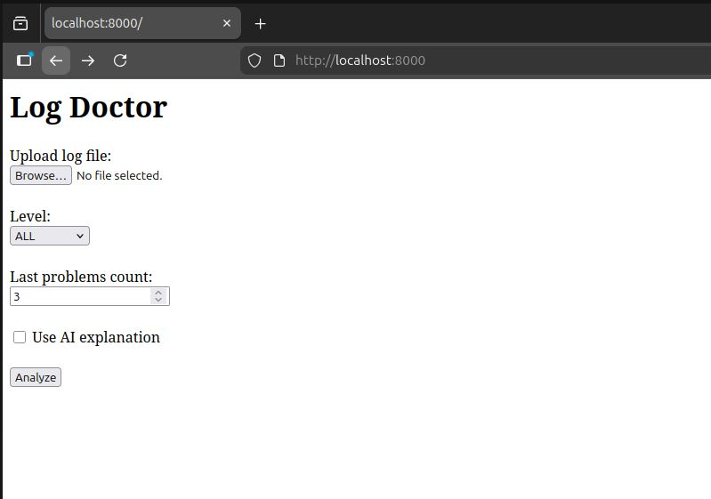
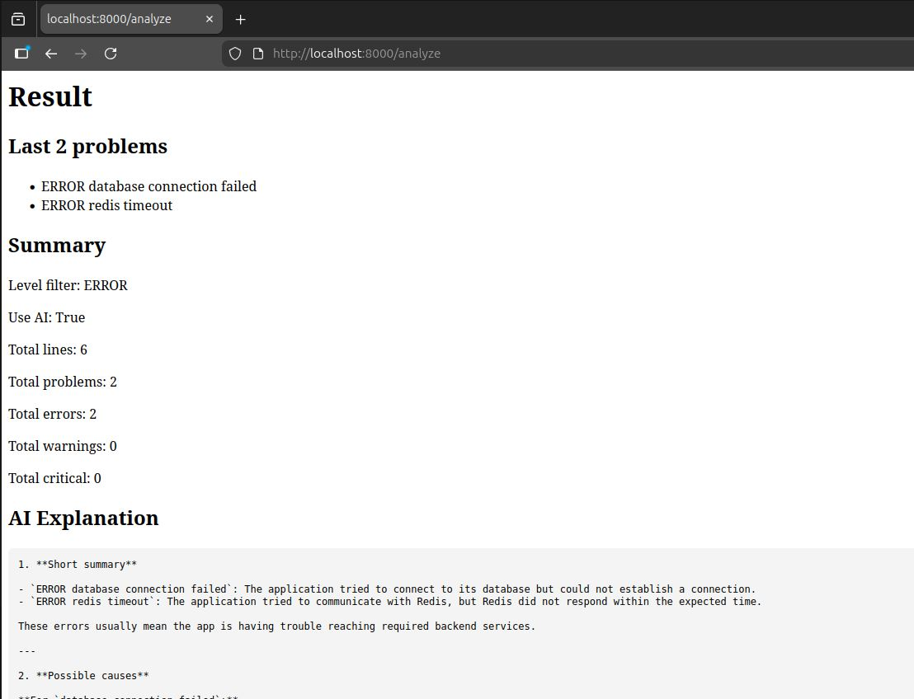

# Log Doctor

Log Doctor is a small Python web app for analyzing log files.

It can find `ERROR`, `WARNING`, and `CRITICAL` messages, show a short summary, and optionally explain found problems using AI.

## Features

* Upload log files from a web page
* Filter logs by level: `ERROR`, `WARNING`, `CRITICAL`
* Show the last N problem lines
* Generate a summary report
* Optional AI explanation for found problems
* Docker-ready





## Run locally

Install dependencies:

```bash
pip install -r requirements.txt
```

Start the web app:

```bash
uvicorn web_app:app --reload
```

Open:

```text
http://localhost:8000
```

## Run with Docker

Build the image:

```bash
docker build -t log-doctor .
```

Run the web app:

```bash
docker run --rm -p 8000:8000 log-doctor
```

Open:

```text
http://localhost:8000
```

## Run with AI

Set your OpenAI API key:

```bash
export OPENAI_API_KEY="your_api_key_here"
```

Run the container:

```bash
docker run --rm \
  -p 8000:8000 \
  -e OPENAI_API_KEY \
  log-doctor
```

## Project structure

```text
log-doctor/
├── analyzer.py       # log analysis logic
├── web_app.py        # FastAPI web app
├── log_doctor.py     # CLI version
├── requirements.txt  # Python dependencies
├── Dockerfile        # Docker image
├── .dockerignore
├── sample.log
└── README.md
```

## What I learned

* Python functions and modules
* Lists and dictionaries
* Command-line arguments with `argparse`
* Log file processing
* FastAPI basics
* File upload handling
* OpenAI API usage
* Docker image build and run
* Passing environment variables to containers
